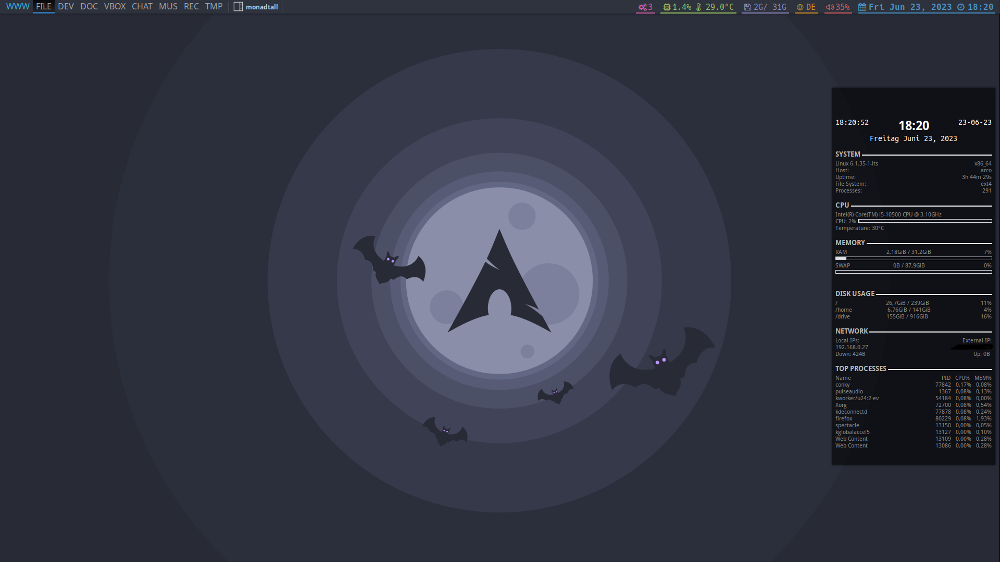

# Qtile configuration file

## Screenshots 🖥️

## What is Qtile?

[Qtile](http://www.qtile.org/) is a window manager written and configured in Python🐍. It is hackable and lightweight, you can install it among other desktop environments and [standalone WM's](https://wiki.archlinux.org/index.php/window_manager).

## Keybindings
| Key | Action |
|---|---|
| F9 | Change Sound Output |
| F10 | Mute |
|F11 | Volume Down |
|F12 | Volume Up |
| Super + Space	| Switch Keyboard Layout |
| Super + q	| Quit Application |
| Super + Shift + r	| Restart Qtile |
| Super + n	| Normalize (Toggle Floating) |
| Super + r | Reset Layout | 
| Super + Tab | Next Layout |
| Super + Left/h | Focus Left |
| Super + Up/j | Focus Up |
| Super + Down/k | Focus Down |
| Super + Right/l | Focus Right |
| Super + Ctrl + Left/h	| Grow (Monadwide) |
| Super + Ctrl + Up/j | Shrink (Monadtall) |
| Super + Ctrl + Down/k	| Grow (Monadtall) |
| Super + Ctrl + Right/l | Shrink (Monadwide) |
| Super + Shift + Left/h | Move Window Left |
| Super + Shift + Up/j | Move Window Up |
| Super + Shift + Down/k | Move Window Down |
| Super + Shift + Right/l | Move Window Right |
| Super + {X}	| Go To {X} Workspace |
| Alt + Tab	| Go To Next Workspace |
| Alt + Shift + Tab | Go To Previous Work| space |
| Super + Shift + {X} | Move Window To {X} Workspace |
| Super + Mouse Left Click | Window Set Floating |
| Super + Mouse Right Click | Window Change Size |
| Super + v	| Clipboard |
| Super + b | Firefox |
| Super + e | Pcmanfm |
| Super + x | Logout Screen |
| Super + Return | Alacritty |
| Super + d | Rofi |
| Super + Shift + s | Restart sxhkd |
| Ctrl + Shift + Escape | Xfce-Taskmanager |
| Print	| Spectacle (Screenshot) |
| F12 |	Xfce Terminal Dropdown |

